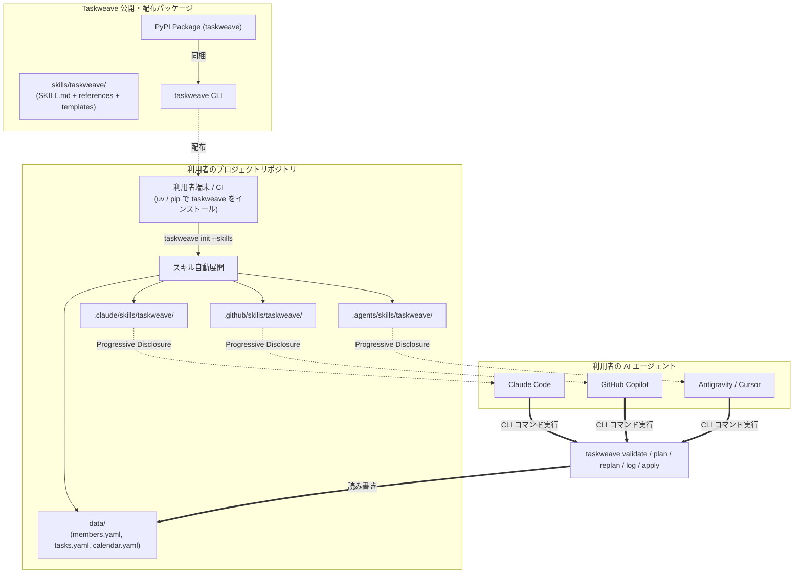

# AI エージェント向け CLI スキルの設計と先行事例調査

本ドキュメントは、Taskweave をはじめとする CLI ツールを外部の AI エージェント（Claude Code, GitHub Copilot, Google Antigravity, Cursor 等）がスムーズかつ自律的に利用できるようにするための「エージェントスキル（Agent Skill）」の設計方針と、Playwright CLI などの先行事例・標準仕様に関する調査結果をまとめた技術資料です。

---

## 1. 調査背景と課題

コーディングエージェント（LLM）にツールを使わせるアプローチとして、主に以下の 2 つが存在します。

1. **MCP (Model Context Protocol) サーバー**:
   - JSON-RPC 経由で構造化されたツール呼び出しを提供する方式。
   - 柔軟だが、エージェントのコンテキストに巨大なツール定義スキーマを常時展開する必要があり、セッション開始時のトークン消費が大きくなる。
2. **CLI + Agent Skill (ドキュメント駆動型 CLI 連携)**:
   - 既存の CLI コマンドを Bash 経由で実行させ、その使い方・手順・ルールを構造化された Markdown（`SKILL.md`）で段階的に教える方式。
   - トークン消費を劇的に抑えつつ、シェル環境と既存 CLI の堅牢性をそのまま活用できる。

Taskweave は「コーディングエージェントのためのスケジュール調整ツール」であり、利用者のプロジェクト内に存在するエージェントが自律的かつ安全に操作できる必要があります。そのため、後者の **「CLI + Agent Skill」** のベストプラクティスを調査・策定しました。

---

## 2. 先行事例分析: Playwright CLI (`@playwright/cli`)

Microsoft Playwright チームが開発した `playwright-cli` は、AI エージェントがブラウザ自動化を行うための専用 CLI とスキルを提供しており、本設計において極めて有用なリファレンスとなります。

### 2.1 なぜ Playwright CLI + Skill なのか

| 比較項目         | Playwright MCP                                           | Playwright CLI + Skill                                   |
| :--------------- | :------------------------------------------------------- | :------------------------------------------------------- |
| **主な用途**     | 探索的なブラウザ操作、GUI 操作                           | コーディングエージェントによるテスト生成・検証           |
| **実行方式**     | JSON-RPC ツールコール                                    | Bash シェルコマンド (`playwright-cli ...`)               |
| **トークン消費** | 高（全ツールスキーマ・DOM スナップショット常時読み込み） | **極小（必要な時だけ `SKILL.md` やリファレンスを参照）** |
| **起動コスト**   | セッションごとにサーバー起動・維持が必要                 | デーモン型アーキテクチャにより高速実行                   |

### 2.2 配布・展開方法 (`install --skills`)

Playwright CLI は、スキルファイルを単にリポジトリで公開するだけでなく、**CLI 自身にスキルインストールコマンドを内包** しています。

```bash
playwright-cli install --skills
```

このコマンドを実行すると、利用者のプロジェクトルート配下に以下のファイル群が自動展開されます：

- `.claude/skills/playwright-cli/SKILL.md`
- `.claude/skills/playwright-cli/references/*.md`

利用者は追加の設定を行うことなく、自分のエージェントに「ブラウザを操作してテストを書いて」と指示するだけで、エージェントが自動的にスキルを発見して CLI を実行できるようになります。

### 2.3 段階的開示（Progressive Disclosure）のファイル構成

Playwright CLI のスキルは、LLM のコンテキストウィンドウを無駄に圧迫しないよう **Progressive Disclosure（段階的開示）** を徹底しています。

- **`SKILL.md` (エントリーポイント)**:
  - YAML frontmatter（`name: playwright-cli`, `description`, `allowed-tools: [Bash]`）
  - 目的とクイックスタート（ツールの存在意義）
  - コアワークフロー（Navigate → Interact → Snapshot の基本ループ）
  - 主要コマンド早見表
  - 各種詳細ガイドへの相対リンク
- **`references/*.md` (詳細リファレンス)**:
  - `test-generation.md`（テストコード生成手順）
  - `request-mocking.md`（ネットワークモックの指定方法）
  - `session-management.md`（複数セッションの並行管理）
  - `tracing.md`（トレースログの取得と解析）

エージェントは通常時は `SKILL.md` の要約のみを把握し、「モックが必要」「トレースを解析したい」といった特定のタスクが発生したときだけ、`references/` 配下のファイルをオンデマンドで読み込みます。

---

## 3. Agent Skills オープン標準の調査

現在、Anthropic（Claude Code）、GitHub Copilot、Google Antigravity、Cursor などの各プラットフォームで、Agent Skills の共通標準仕様（[agentskills.io](https://agentskills.io)）が確立されつつあります。

### 3.1 共通ファイル構造

```text
<skill-name>/
├── SKILL.md            # [必須] メインエントリ。YAML frontmatter + 基本指示
├── references/         # [任意] 段階的開示用の詳細リファレンス (スキーマ、ワークフロー、トラブル対応)
├── scripts/            # [任意] エージェントが実行可能な補助スクリプト (バリデータ、ラッパーなど)
└── assets/             # [任意] テンプレートファイル、初期設定データ (YAML 雛形など)
```

### 3.2 プラットフォーム別配置場所

| エージェントツール     | プロジェクトローカル配置パス                              | ユーザーグローバル配置パス              |
| :--------------------- | :-------------------------------------------------------- | :-------------------------------------- |
| **Claude Code**        | `.claude/skills/<skill-name>/`                            | `~/.claude/skills/<skill-name>/`        |
| **GitHub Copilot**     | `.github/skills/<skill-name>/`                            | -                                       |
| **Google Antigravity** | `.agents/skills/<skill-name>/` (または `.github/skills/`) | `~/.gemini/antigravity/builtin/skills/` |
| **Cursor / 汎用**      | `.cursor/rules/` またはリポジトリルート                   | -                                       |

---

## 4. Taskweave CLI への適用検討

### 4.1 エージェントに守らせるべき重要行動規範（Guardrails）

Taskweave をエージェントが操作する上で、ハルシネーションやデータ破損を防ぐために以下の 3 原則をスキルに組み込む必要があります。

1. **原本データ（SSOT）の保護**:
   - `members.yaml`, `tasks.yaml`, `calendar.yaml`, `actuals.yaml` が唯一の正本（SSOT）である。
   - `plan` や `replan` の出力（Gantt, Markdown, JSON）は「計算結果（読み取り専用）」であり、原本 YAML に勝手に上書きしてはならない。
2. **実績工数（actual hours）と残工数（remaining hours）の峻別**:
   - 作業実績は `taskweave log` で記録し、タスクの見積工数（`estimate_hours`）を直接削ったり変更したりしない。
   - 16h 見積のタスクで 16h 働いても終わっていない場合、残工数（`--remaining`）を必ず確認・更新する。
3. **合意なき確定（Apply）の禁止**:
   - 遅延発生時の再計画（`replan`）では、診断レポートや推奨納期緩和日数を Markdown / Mermaid で人間に提示し、合意を得てから `taskweave apply --update-tasks` を実行する。

### 4.2 Taskweave スキルの推奨ファイル構成

```text
skills/taskweave/
├── SKILL.md                  # メインエントリ：原則、クイックコマンド早見表、Progressive Disclosure 案内
├── references/
│   ├── yaml-schemas.md       # members, tasks, calendar, actuals の詳細スキーマ定義
│   ├── workflows.md          # 3大ユースケース（初期計画、日次実績ログ、遅延再計画と合意形成）
│   ├── cli-reference.md      # CLIサブコマンド・全フラグ・終了コード完全リファレンス
│   └── troubleshooting.md   # INFEASIBLE、循環依存、スキル不足等の診断・リカバリ手順
└── assets/
    └── templates/            # 初期立ち上げ用テンプレート YAML (members, tasks, calendar)
```

### 4.3 スキル配布アーキテクチャ図



### 4.4 エージェント運用ライフサイクル図

```mermaid
flowchart TD
    Start(["ユーザーからの要求\n（計画立案、進捗報告、遅延相談）"]) --> IntentCheck{"エージェントの\nインテント判定"}

    %% シナリオ 1: 初期計画
    IntentCheck -->|"初期計画の立案"| S1_Edit["1. members / tasks / calendar.yaml を編集・確認"]
    S1_Edit --> S1_Val["2. taskweave validate を実行"]
    S1_Val -->|エラー| S1_Fix["スキーマエラーを修正"] --> S1_Val
    S1_Val -->|OK| S1_Plan["3. taskweave plan --format markdown --format mermaid"]
    S1_Plan --> S1_Report["4. ガントチャート & スケジュールをユーザーへ提示"]

    %% シナリオ 2: 実績記録
    IntentCheck -->|"日次進捗・作業完了の記録"| S2_Log["1. taskweave log <date> --member ... --task ... --hours ..."]
    S2_Log --> S2_Replan["2. taskweave replan --as-of <date> --format markdown"]
    S2_Check{"遅延やボトルネックの有無"}
    S2_Replan --> S2_Check
    S2_Check -->|順調| S2_Report["進捗サマリと最新見通しを報告"]

    %% シナリオ 3: 再計画とリカバリ
    S2_Check -->|遅延警告あり| S3_Diag["3. 遅延タスク診断と推奨納期緩和を確認"]
    IntentCheck -->|"遅延リカバリ・リスケジュール"| S3_Diag
    S3_Diag --> S3_Propose["4. ユーザーへリカバリ選択肢を提案\n(納期緩和 / 担当変更 / 負荷平準化)"]
    S3_Propose --> S3_UserApprove{"ユーザー承認"}
    S3_UserApprove -->|差分修正指示| S3_Adjust["tasks.yaml または actuals を調整"] --> S2_Replan
    S3_UserApprove -->|合意完了| S3_Apply["5. taskweave apply --as-of <date> --update-tasks"]
    S3_Apply --> S3_Commit["6. 確定ベースラインと更新タスクを保存・報告"]
```



---

## 5. まとめと今後の実装への反映

以上の調査と分析に基づき、Milestone 6 では以下の 3 ステップで実装を進めます。

1. **スキルアセットの策定と配置 (`skills/taskweave/`)**:
   - `SKILL.md`, `references/`, `assets/templates/` をリポジトリルートに独立作成し、SSOT として管理する（Issue #62）。
2. **CLI 展開コマンドの実装 (`taskweave init` / `skills install`)**:
   - Python パッケージ内にスキルアセットを内包し、利用者のプロジェクト環境に合わせて自動配置する CLI 機能を実装する（Issue #63）。
3. **パッケージング設定と導入ドキュメント整備**:
   - `pyproject.toml` に wheel 同梱設定を追加し、`README.md` にエージェント向け導入ガイドを記載する（Issue #64）。
