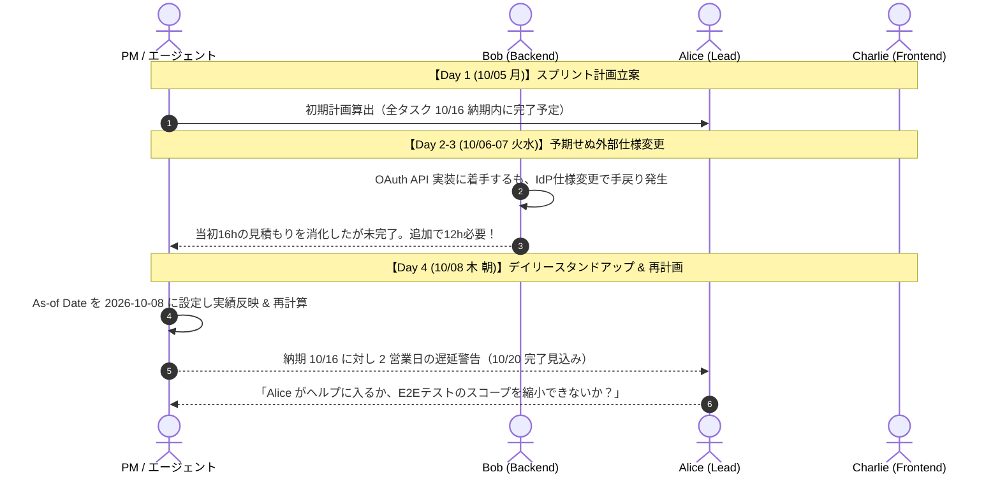

# 実務シナリオ 1: 新機能スプリントでの見積超過・手戻りと納期危機

## 1. 業務背景とチーム体制

- **プロジェクト**: 2週間の新機能開発スプリント（外部 IdP 連携による OAuth2.0 / OIDC 認証認可基盤のリプレイス）。
- **期間**: 2026-10-05（月）〜 2026-10-16（金）の 10 営業日。
- **デッドライン**: 2026-10-16（金）にステージング環境へデプロイし、ステークホルダーレビューを受ける必達納期。
- **チーム体制（3名）**:
  - `alice` (Alice): テックリード / フルスタック (`skills: [backend, frontend, architecture]`, `max_capacity: 1.0` [8h/日])
  - `bob` (Bob): バックエンドエンジニア (`skills: [backend]`, `max_capacity: 1.0` [8h/日])
  - `charlie` (Charlie): フロントエンドエンジニア (`skills: [frontend]`, `max_capacity: 1.0` [8h/日])

---

## 2. 現場の時系列ストーリー



### Day 1 (10/05 月) - スプリント計画の立案

スプリントバックログには 5 つのタスクが並びました：

1. `task-arch`: 認証シーケンス詳細設計（8h, Alice担当）
2. `task-oauth-api`: OAuth2.0 バックエンド API 実装（16h, 要 `backend` スキル）
3. `task-login-ui`: ログイン・同意画面 UI 実装（16h, 要 `frontend` スキル）
4. `task-ui-integration`: フロント・バック疎通結合（12h, 要 `frontend`, `backend`。`task-oauth-api` と `task-login-ui` に依存）
5. `task-e2e-test`: E2E シナリオ自動テスト作成（16h, `task-ui-integration` に依存, 納期: 2026-10-16）

初期計画を計算したところ、Alice, Bob, Charlie の 3 名で依存関係に沿って並行作業が進み、最終日の 10/16（金）夕方にジャストで完了する綺麗なスケジュールが立ちました。

### Day 2〜3 (10/06 火 〜 10/07 水) - 予期せぬ手戻りの発生

Bob は Day 2 から `task-oauth-api` に着手しました。しかし、接続先である外部 IdP のサンドボックス環境で最新の仕様変更が入っており、トークンリフレッシュの挙動が公式ドキュメントと乖離していることが判明。Bob は丸 2 日間（16h）調査と実装に費やしましたが、エラーが解消できずタスクは未完了のままです。

### Day 4 (10/08 木 朝) - デイリースタンドアップと再計画の必要性

木曜朝のデイリースタンドアップで、Bob から重い報告がありました：

> 「外部 IdP の仕様差異を吸収するため、認可コードのバリデーションロジックを書き直す必要があります。すでに 16h を使い切りましたが、あと追加で 12h（1.5日分）かかりそうです……」

PM（または進行役のコーディングエージェント）は、起算日（As-of Date）を本日 `2026-10-08` に設定し、これまでの作業実績（Bob が 16h 消化、残り 12h、ステータス `in_progress`）を `actuals.yaml` に記録して再計画を実行することにしました。

---

## 3. Taskweave 原本データ定義

### `members.yaml`

```yaml
members:
  - id: alice
    name: "Alice"
    max_capacity: 1.0
    skills:
      - backend
      - frontend
      - architecture
  - id: bob
    name: "Bob"
    max_capacity: 1.0
    skills:
      - backend
  - id: charlie
    name: "Charlie"
    max_capacity: 1.0
    skills:
      - frontend
```

### `tasks.yaml`

```yaml
tasks:
  - id: task-arch
    title: "認証シーケンス詳細設計"
    estimate_hours: 8.0
    required_skills:
      - architecture
    depends_on: []
    deadline: "2026-10-06"

  - id: task-oauth-api
    title: "OAuth2.0 バックエンド API 実装"
    estimate_hours: 16.0
    required_skills:
      - backend
    depends_on:
      - task-arch
    deadline: "2026-10-16"

  - id: task-login-ui
    title: "ログイン・同意画面 UI 実装"
    estimate_hours: 16.0
    required_skills:
      - frontend
    depends_on:
      - task-arch
    deadline: "2026-10-16"

  - id: task-ui-integration
    title: "フロント・バック疎通結合"
    estimate_hours: 12.0
    required_skills:
      - frontend
      - backend
    depends_on:
      - task-oauth-api
      - task-login-ui
    deadline: "2026-10-16"

  - id: task-e2e-test
    title: "E2E シナリオ自動テスト作成"
    estimate_hours: 16.0
    required_skills: []
    depends_on:
      - task-ui-integration
    deadline: "2026-10-16"
```

### `calendar.yaml`

```yaml
calendar:
  workdays:
    - mon
    - tue
    - wed
    - thu
    - fri
  holidays:
    - date: "2026-10-12"
      name: "スポーツの日"
```

### `actuals.yaml` (Day 4 朝時点)

```yaml
actuals:
  work_logs:
    # 10/05 (月)
    - date: "2026-10-05"
      member_id: alice
      task_id: task-arch
      hours: 8.0
    # 10/06 (火)
    - date: "2026-10-06"
      member_id: bob
      task_id: task-oauth-api
      hours: 8.0
    - date: "2026-10-06"
      member_id: charlie
      task_id: task-login-ui
      hours: 8.0
    # 10/07 (水)
    - date: "2026-10-07"
      member_id: bob
      task_id: task-oauth-api
      hours: 8.0
    - date: "2026-10-07"
      member_id: charlie
      task_id: task-login-ui
      hours: 8.0
  task_progress:
    - task_id: task-arch
      remaining_hours: 0.0
      status: completed
    - task_id: task-oauth-api
      remaining_hours: 12.0 # 見積16h消化後、さらに12h必要（合計28h見込みの炎上）
      status: in_progress
    - task_id: task-login-ui
      remaining_hours: 0.0
      status: completed
    - task_id: task-ui-integration
      remaining_hours: 12.0
      status: not_started
    - task_id: task-e2e-test
      remaining_hours: 16.0
      status: not_started
```

---

## 4. Taskweave での期待動作と出力

1. **原本検証 (`validate`)**:
   - `actuals.yaml` の構文、型、残工数、作業ログ合計（Bob 16h、Charlie 16h）が正常にパスすること。
2. **起算日再計画 (`as_of_date: "2026-10-08"`)**:
   - 過去（10/05〜10/07）の実績がガントチャート上で固定されること。
   - `task-oauth-api` は着手済みのため Bob にピン留めされ、10/08（木）に 8h、10/09（金）に 4h 割り当てられ、10/09 に完了すること。
   - 10/12（月）が「スポーツの日（祝日）」のためスキップされること。
   - 後続の `task-ui-integration`（12h）は 10/13（火）以降にしか着手できず、完了が 10/14（水）にずれ込むこと。
   - 最終タスク `task-e2e-test`（16h）は 10/15（木）〜 10/16（金）に作業されるが、工数が溢れるか翌週 10/19（月）までずれ込み、**10/16 納期に対する遅延が検知されること**。
3. **診断レポート (Diagnostics)**:
   - `is_deadline_violated: true`
   - 遅延タスクとして `task-e2e-test`（および場合により後続）がリストされ、遅延原因として `task-oauth-api` の工数増大と先行ブロックが特定されること。

---

## 5. 現場視点での改善点発掘チェックシート

このシナリオを実際に動かしてみて、以下の観点から Taskweave の使い勝手やアルゴリズムの改善点を検証・議論します。

- [ ] **Q1. 着手済みタスクの担当者ピン留め（FR-12）の柔軟性**:
  - _現場の疑問_: Bob のタスクが炎上した際、現場では「Alice（フルスタックリード）が途中から引き継ぐ」または「Alice と Bob でペアプロ/分担して巻き返す」という意思決定がよく行われます。
  - _Taskweaveの現状_: 現在の仕様では、一度実績を記録したタスクは元の担当者に 100% ピン留め固定されます。
  - _改善の着眼点_: 実績ログに記録された担当者から別メンバーへ未完了残工数を「引き継ぐ（Reassign / Handoff）」ことを明示的に指定できる仕組みが必要ではないか？
- [ ] **Q2. ボトルネック特定からトリアージ（スコープ縮小）への誘導**:
  - _現場の疑問_: 「2日遅延する」と分かったとき、PMが次に知りたいのは「どのタスクを何時間削れば 10/16 納期に収まるか」です。
  - _Taskweaveの現状_: 遅延日数と原因タスクのリストは出るが、「E2Eテストを 8h 削れば間に合う」「Alice の余剰キャパシティを活用すれば何日短縮できる」といった処方箋（Actionable Recommendation）までは出ない。
  - _改善の着眼点_: 診断結果に「納期回復のための感度分析（どのタスクを削減/前倒しすべきかのサジェスト）」を含められないか？
- [ ] **Q3. 実績入力の手間と As-of Date の運用性**:
  - _現場の疑問_: 毎朝のスタンドアップで `actuals.yaml` に日付と時間を YAML 直書きするのは面倒ではないか？
  - _改善の着眼点_: `taskweave log --member bob --task task-oauth-api --hours 8` のような手軽な CLI コマンドや、GitHub PR / Issue のアクティビティから実績を自動抽出する機能が Milestone 4 で必要にならないか？
