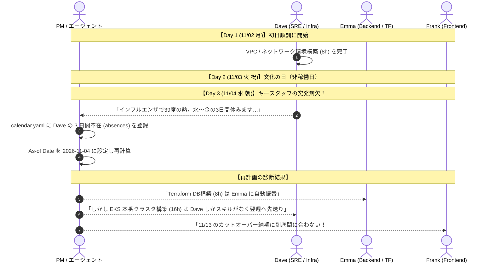

# 実務シナリオ 2: リリース直前のキースタッフ突発病欠と属人化の壁

## 1. 業務背景とチーム体制

- **プロジェクト**: オンプレミスから AWS / EKS へのクラウドインフラ移行プロジェクト。
- **期間**: 2026-11-02（月）〜 2026-11-13（金）の 2 週間（9 営業日、11/03 は文化の日で祝日）。
- **デッドライン**: 2026-11-13（金）夜の本番切り替え（カットオーバー）必達。
- **チーム体制（3名）**:
  - `dave` (Dave): SRE / インフラ専任 (`skills: [k8s, terraform]`, `max_capacity: 1.0` [8h/日])
  - `emma` (Emma): バックエンドエンジニア兼サブインフラ (`skills: [backend, terraform]`, `max_capacity: 1.0` [8h/日])
  - `frank` (Frank): フロントエンドエンジニア (`skills: [frontend]`, `max_capacity: 1.0` [8h/日])

---

## 2. 現場の時系列ストーリー



### Day 1 (11/02 月) - スムーズな滑り出し

プロジェクト初日、Dave は Terraform による VPC ネットワーク構築（`task-tf-vpc`, 8h）を順調に完了しました。Emma はバックエンドのコンテナ化準備（`task-app-docker`, 8h）に着手し、Frank はフロントエンドの環境変数切替改修を進めています。

### Day 2 (11/03 火 祝日) - 文化の日

カレンダー定義によりチーム全員が休日。

### Day 3 (11/04 水 朝) - 突然のインフルエンザ連絡

水曜日の早朝、Dave から Slack で連絡が入りました：

> 「深夜から 39 度の高熱が出て病院に行ったところ、インフルエンザ A 型と診断されました。医師から金曜日まで外出停止を指示されたため、11/04（水）〜 11/06（金）の 3 日間急遽お休みをいただきます……」

残っている未着手のインフラタスクは 2 つ：

1. `task-tf-db`: RDS / Aurora DB クラスタ構築（8h, 要 `terraform` スキル）
2. `task-k8s-cluster`: EKS 本番クラスタ設計・構築・セキュリティ設定（16h, 要 `k8s` スキル）

チーム内で `k8s` スキルを持つのは Dave ただ 1 人。Emma は `terraform` は扱えるが `k8s` は未経験。Frank はインフラ全般のスキルを持っていません。

### Day 3 午前 - PMによる再計画の実行

PMは `calendar.yaml` に Dave の 3 日間の不在（`absences`）を追記し、起算日 `2026-11-04` で再計画を計算させました。

---

## 3. Taskweave 原本データ定義

### `members.yaml`

```yaml
members:
  - id: dave
    name: "Dave"
    max_capacity: 1.0
    skills:
      - k8s
      - terraform
  - id: emma
    name: "Emma"
    max_capacity: 1.0
    skills:
      - backend
      - terraform
  - id: frank
    name: "Frank"
    max_capacity: 1.0
    skills:
      - frontend
```

### `tasks.yaml`

```yaml
tasks:
  - id: task-tf-vpc
    title: "VPC / ネットワーク環境構築"
    estimate_hours: 8.0
    required_skills:
      - terraform
    depends_on: []
    deadline: "2026-11-04"

  - id: task-tf-db
    title: "RDS / Aurora DB クラスタ構築"
    estimate_hours: 8.0
    required_skills:
      - terraform
    depends_on:
      - task-tf-vpc
    deadline: "2026-11-09"

  - id: task-k8s-cluster
    title: "EKS 本番クラスタ設計・構築"
    estimate_hours: 16.0
    required_skills:
      - k8s
    depends_on:
      - task-tf-vpc
    deadline: "2026-11-09"

  - id: task-app-deploy
    title: "アプリケーション本番デプロイ & 疎通確認"
    estimate_hours: 16.0
    required_skills:
      - backend
    depends_on:
      - task-tf-db
      - task-k8s-cluster
    deadline: "2026-11-13"

  - id: task-cutover
    title: "DNS切替 & 本番カットオーバー判定"
    estimate_hours: 8.0
    required_skills: []
    depends_on:
      - task-app-deploy
    deadline: "2026-11-13"
```

### `calendar.yaml` (Daveの3日間不在を反映後)

```yaml
calendar:
  workdays:
    - mon
    - tue
    - wed
    - thu
    - fri
  holidays:
    - date: "2026-11-03"
      name: "文化の日"
  absences:
    - member_id: dave
      date: "2026-11-04"
      name: "インフルエンザ病欠"
    - member_id: dave
      date: "2026-11-05"
      name: "インフルエンザ病欠"
    - member_id: dave
      date: "2026-11-06"
      name: "インフルエンザ病欠"
```

### `actuals.yaml` (Day 3 朝時点)

```yaml
actuals:
  work_logs:
    - date: "2026-11-02"
      member_id: dave
      task_id: task-tf-vpc
      hours: 8.0
  task_progress:
    - task_id: task-tf-vpc
      remaining_hours: 0.0
      status: completed
    - task_id: task-tf-db
      remaining_hours: 8.0
      status: not_started
    - task_id: task-k8s-cluster
      remaining_hours: 16.0
      status: not_started
    - task_id: task-app-deploy
      remaining_hours: 16.0
      status: not_started
    - task_id: task-cutover
      remaining_hours: 8.0
      status: not_started
```

---

## 4. Taskweave での期待動作と出力

1. **Dave の不在期間中のゼロキャパシティ制御**:
   - 11/04, 11/05, 11/06 の Dave の稼働時間は 0h として扱われ、Dave にタスクが割り当てられないこと。
2. **スキル制約に基づく代替割当**:
   - `task-tf-db`（要 `terraform`）は、スキルを持つ Emma に自動的に再割り当てされ、11/04（水）に Emma が着手・完了すること。
3. **属人化タスクの待機と玉突き遅延**:
   - `task-k8s-cluster`（要 `k8s`）はチーム内で Dave しかスキルを持たないため、Emma にも Frank にも振替できず、Dave の復帰日である 11/09（月）まで開始が保留されること。
   - Dave が 11/09（月）〜 11/10（火）に `task-k8s-cluster`（16h）を実施。
   - その後続である `task-app-deploy`（16h）は 11/11（水）〜 11/12（木）に実施。
   - 最終タスク `task-cutover`（8h）が 11/13（金）にギリギリ収まるか、あるいはカットオーバー判定が翌週にこぼれるかの瀬戸際を判定。
4. **診断レポート**:
   - 11/09 納期指定の `task-k8s-cluster` が納期超過（delay_days > 0）と診断され、原因として Dave の欠勤と先行ブロックが明示されること。

---

## 5. 現場視点での改善点発掘チェックシート

このシナリオを実際に動かしてみて、以下の観点から Taskweave の使い勝手やアルゴリズムの改善点を検証・議論します。

- [ ] **Q1. 属人化リスク（SPOF: Single Point of Failure）の事前検知**:
  - _現場の疑問_: 不在が発生する「前（初日の初期計画時）」に、「このプロジェクトには Dave しか担当できないタスクが 16h あり、Dave が 1 日でも休むと納期が破綻する」というリスクをチームは事前に知りたい。
  - _Taskweaveの現状_: 現状のエンジンは、実際に不在が発生して遅延するまでリスクを警告しない。
  - _改善の着眼点_: 初期計画計算時に「特定メンバーにしか担当できないタスクの割合（属人度）」や「バッファ（Float / Slack）の余裕」を分析し、**SPOF リスク警告** をレポートに出力できないか？
- [ ] **Q2. スキル要件の緩和・ペア作業の表現**:
  - _現場の疑問_: 現実には「Emma がメインでやりつつ、復帰した Dave がレビューする」「スキル要件を一時的に下げて別メンバーがチュートリアル見ながらやる」といった妥協案が取られます。
  - _Taskweaveの現状_: `required_skills` は絶対制約（ハード制約）であり、スキルを持たないメンバーには 1 分も割り当てられない。
  - _改善の着眼点_: 「推奨スキル（ソフト制約）」や「習熟度（0.5 のスピードで進行）」のような柔軟なスキルモデルの必要性はあるか？
- [ ] **Q3. 代替振替に伴う玉突き（Ripple Effect）の可視化**:
  - _現場の疑問_: Dave の代わりに Emma がインフラタスクをやったことで、Emma 本来のタスクが誰に押し出され、どこにシワ寄せが行ったのかを PM はメンバーに説明したい。
  - _Taskweaveの現状_: 出力されるスケジュールを見比べれば分かるが、差分（Diff）として「Dave 不在により task-tf-db が Emma へ振替」と明示されない。
  - _改善の着眼点_: Issue #28（Diff 出力）において、「メンバー間振替イベント」をハイライト表示する機能が必要。
