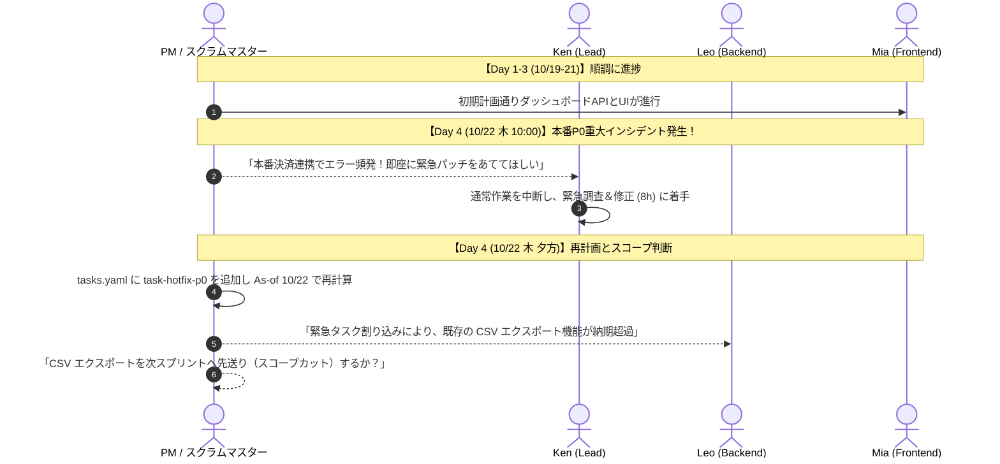

# 実務シナリオ 3: 本番障害による緊急割り込みタスクとスコープ調整

## 1. 業務背景とチーム体制

- **プロジェクト**: 定常のプロダクト機能改善スプリント（顧客向けダッシュボード機能の追加）。
- **期間**: 2026-10-19（月）〜 2026-10-30（金）の 10 営業日。
- **スプリントゴール**: 10/30（金）までに新ダッシュボードと CSV エクスポート機能をリリース。
- **チーム体制（3名）**:
  - `ken` (Ken): リードエンジニア (`skills: [backend, infra]`, `max_capacity: 1.0` [8h/日])
  - `leo` (Leo): バックエンドエンジニア (`skills: [backend]`, `max_capacity: 1.0` [8h/日])
  - `mia` (Mia): フロントエンドエンジニア (`skills: [frontend]`, `max_capacity: 1.0` [8h/日])

---

## 2. 現場の時系列ストーリー



### Day 1〜3 (10/19 月 〜 10/21 水) - 順調なスプリント進捗

チームはダッシュボード機能の開発を順調に進めていました。Ken と Leo は集計 API を実装し、Mia は画面のデザインコンポーネントを組み立てていました。

### Day 4 (10/22 木 10:00) - 本番 P0 障害の緊急割り込み

木曜日の午前 10 時、本番監視アラートが鳴り響きました。外部決済代行会社の API バージョンアップに伴い、特定条件下で決済完了Webhookがタイムアウトし、注文が宙に浮くという致命的なバグが発覚。

CTO およびプロダクト責任者から指示が飛びます：

> 「何よりも最優先で、今日中にホットフィックスを本番適用してください。スプリントの作業は一旦止めて構いません！」

最も決済基盤とインフラに詳しい Ken が、午前中の通常タスクを中断し、急遽 `task-hotfix-p0`（調査・修正・緊急リリース、工数 8h）に全力を注ぐことになりました。

### Day 4 夕方 - 再計画とトリアージ（スコープ調整）

緊急パッチは無事にデプロイされましたが、Ken の通常作業が丸 1 日分消失。さらに、スプリント内に予定していた優先度の低いタスク（`task-csv-export`, 見積 16h）にしわ寄せが行くことが確実となりました。

PMは、Taskweave に緊急タスクの実績を追加した上で、今後のスケジュールを再計算し、**「何を諦めるべきか（スコープカット判断）」**をチームと議論する必要があります。

---

## 3. Taskweave 原本データ定義

### `members.yaml`

```yaml
members:
  - id: ken
    name: "Ken"
    max_capacity: 1.0
    skills:
      - backend
      - infra
  - id: leo
    name: "Leo"
    max_capacity: 1.0
    skills:
      - backend
  - id: mia
    name: "Mia"
    max_capacity: 1.0
    skills:
      - frontend
```

### `tasks.yaml` (緊急タスク追加後)

```yaml
tasks:
  - id: task-dashboard-api
    title: "ダッシュボード集計 API 実装"
    estimate_hours: 24.0
    required_skills:
      - backend
    depends_on: []
    deadline: "2026-10-23"

  - id: task-dashboard-ui
    title: "ダッシュボード画面 UI 実装"
    estimate_hours: 32.0
    required_skills:
      - frontend
    depends_on: []
    deadline: "2026-10-28"

  - id: task-hotfix-p0 # 【緊急割り込みタスク】
    title: "【障害対応】決済 Webhook タイムアウト緊急パッチ"
    estimate_hours: 8.0
    required_skills:
      - backend
      - infra
    depends_on: []
    deadline: "2026-10-22"

  - id: task-csv-export # 【スコープカット候補】
    title: "CSV エクスポート機能実装"
    estimate_hours: 16.0
    required_skills:
      - backend
    depends_on:
      - task-dashboard-api
    deadline: "2026-10-30"

  - id: task-sprint-review
    title: "スプリント最終リリース & 動作検証"
    estimate_hours: 8.0
    required_skills: []
    depends_on:
      - task-dashboard-ui
      - task-csv-export
    deadline: "2026-10-30"
```

### `calendar.yaml`

```yaml
calendar:
  workdays:
    - mon
    - tue
    - wed
    - thu
    - fri
  holidays: []
```

### `actuals.yaml` (10/22 障害対応完了時点)

```yaml
actuals:
  work_logs:
    # 10/19 (月)
    - date: "2026-10-19"
      member_id: ken
      task_id: task-dashboard-api
      hours: 8.0
    - date: "2026-10-19"
      member_id: mia
      task_id: task-dashboard-ui
      hours: 8.0
    # 10/20 (火)
    - date: "2026-10-20"
      member_id: ken
      task_id: task-dashboard-api
      hours: 8.0
    - date: "2026-10-20"
      member_id: mia
      task_id: task-dashboard-ui
      hours: 8.0
    # 10/21 (水)
    - date: "2026-10-21"
      member_id: ken
      task_id: task-dashboard-api
      hours: 8.0
    - date: "2026-10-21"
      member_id: mia
      task_id: task-dashboard-ui
      hours: 8.0
    # 10/22 (木) - 緊急割り込み対応
    - date: "2026-10-22"
      member_id: ken
      task_id: task-hotfix-p0
      hours: 8.0
    - date: "2026-10-22"
      member_id: mia
      task_id: task-dashboard-ui
      hours: 8.0
  task_progress:
    - task_id: task-dashboard-api
      remaining_hours: 0.0
      status: completed
    - task_id: task-hotfix-p0
      remaining_hours: 0.0
      status: completed
    - task_id: task-dashboard-ui
      remaining_hours: 8.0
      status: in_progress
    - task_id: task-csv-export
      remaining_hours: 16.0
      status: not_started
    - task_id: task-sprint-review
      remaining_hours: 8.0
      status: not_started
```

---

## 4. Taskweave での期待動作と出力

1. **緊急タスクの過去実績固定**:
   - `task-hotfix-p0` は 10/22 に Ken が 8h 消化し完了として固定されること。
2. **残タスクの再スケジューリング**:
   - 起算日 `2026-10-23`（金）以降、Ken と Leo のバックエンド余剰キャパシティに応じて `task-csv-export` が割り当てられること。
   - Leo が 10/23〜10/26 で `task-csv-export` を消化し、Ken も別作業を行うが、依存関係と全体工数の関係で最終タスク `task-sprint-review`（8h）の開始が遅れる。
3. **遅延警告とボトルネック特定**:
   - スプリント最終日（10/30 金）の納期に対し、バッファが消失または遅延することが診断されること。

---

## 5. 現場視点での改善点発掘チェックシート

このシナリオを実際に動かしてみて、以下の観点から Taskweave の使い勝手やアルゴリズムの改善点を検証・議論します。

- [ ] **Q1. 優先度（Priority）の表現力**:
  - _現場の疑問_: 実務では「P0（緊急・最優先）」「P1（通常）」「P2（できれば）」という優先順位がタスクに付与されます。
  - _Taskweaveの現状_: 現在のスキーマには `priority` フィールドがなく、納期（`deadline`）を早く設定したり、依存関係で縛ることでしか優先度を表現できない。
  - _改善の着眼点_: `priority: urgent / high / normal / low` をタスクに持たせ、ソルバーが「リソース競合時に高優先度タスクを優先的に前倒しする」目的関数をサポートすべきではないか？
- [ ] **Q2. スコープ除外（先送り・トリアージ）のワークフロー**:
  - _現場の疑問_: 納期が溢れた際、PMは「CSV エクスポートを今回のリリースから外そう」と決めます。その時、どう操作すべきか？
  - _Taskweaveの現状_: `tasks.yaml` から該当ブロックを手動で削除（またはコメントアウト）し、依存関係の参照を手作業で修正する必要がある。
  - _改善の着眼点_: タスクに `active: false` や `status: deferred` のようなフラグを設けるか、CLI で `taskweave exclude task-csv-export` のように一時除外してシミュレーションできる機能が必要ではないか？
- [ ] **Q3. 当日の「日中割り込み」の扱い（半日単位の実績記録）**:
  - _現場の疑問_: 障害対応が「午前 10 時〜午後 15 時（5 時間）」で終わり、残りの 3 時間は通常タスクをやった、という半日単位の割り込みが日常茶飯事です。
  - _Taskweaveの現状_: 実績ログ `actuals.yaml` は `hours: 5.0` と `hours: 3.0` で記録可能だが、同一日・同一担当者でのタスク切り替えの順序や優先順位が直感的に扱えるか？
