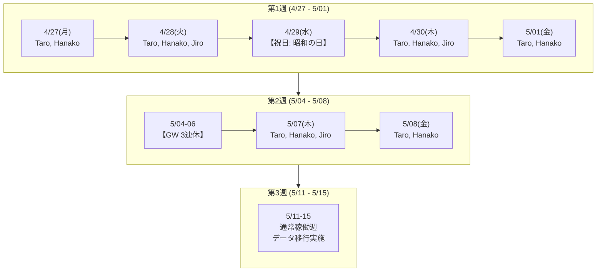

# 実務シナリオ 4: 大型連休の飛び石稼働と短時間勤務・業務委託混成チーム

## 1. 業務背景とチーム体制

- **プロジェクト**: 基幹データベースリプレイスおよびデータマイグレーション。
- **期間**: 2026-04-27（月）〜 2026-05-15（金）の 3 週間。
- **カレンダー事情**: 日本のゴールデンウィーク（GW）を挟むため、祝日と振替休日が密集し、稼働日が「飛び石（4/27-28, 4/30-5/1, 5/7-8, 5/11-15）」となります。
  - 4/29（水）: 昭和の日
  - 5/03（日）: 憲法記念日
  - 5/04（月）: みどりの日
  - 5/05（火）: こどもの日
  - 5/06（水）: 振替休日
- **チーム体制（雇用形態・稼働パターンの異なる混成チーム 3名）**:
  - `taro` (Taro): フルタイム正社員リード (`skills: [db, backend]`, `max_capacity: 1.0` [8h/日])
  - `hanako` (Hanako): 育児短時間勤務正社員 (`skills: [db, testing]`, `max_capacity: 0.625` [5h/日])
  - `jiro` (Jiro): 業務委託シニアDBアーキテクト (`skills: [db-arch]`, 週2日 [火曜日・木曜日のみ] 稼働)

---

## 2. 現場の時系列ストーリー



### 連休前の課題: 「Jiro（週2日アーキテクト）のレビューが連休前に終わるか？」

プロジェクト成功の鍵は、Jiro による「マイグレーション計画レビュー（`task-arch-review`, 8h）」。このレビューが連休前（5/01 まで）に承認されないと、Hanako や Taro は連休明けの移行スクリプト作成・テストに着手できず、プロジェクト全体が丸々 1 週間ストップしてしまいます。

Jiro が稼働できるのは、連休前では 4/28（火）と 4/30（木）の 2 日間のみ。

### 時短勤務 Hanako のキャパシティ平準化

Hanako は 1 日あたり 5 時間（`max_capacity: 0.625`）の勤務です。テスト検証タスク（`task-test-dryrun`, 12h）を担当する場合、無理に 1 日に詰め込まず、複数日にまたがって自然に日割り（1日目 5h + 2日目 5h + 3日目 2h）で計画される必要があります。

### 連休中の「中抜け」と作業の分断

カレンダー上で 5/02（土）〜 5/06（水）の 5 連休が発生します。連休直前の 5/01（金）に中途半端にタスクを着手して連休を挟むと、コンテキストスイッチのコストが大きくなります。Taskweave は連休を跨ぐタスクをどのようにスケジューリングするでしょうか？

---

## 3. Taskweave 原本データ定義

### `members.yaml`

```yaml
members:
  - id: taro
    name: "Taro"
    max_capacity: 1.0 # 8h / 日
    skills:
      - db
      - backend
  - id: hanako
    name: "Hanako"
    max_capacity: 0.625 # 5h / 日 (育児短時間勤務)
    skills:
      - db
      - testing
  - id: jiro
    name: "Jiro"
    max_capacity: 1.0 # 稼働日は 8h / 日
    skills:
      - db-arch
```

### `calendar.yaml`

```yaml
calendar:
  workdays:
    - mon
    - tue
    - wed
    - thu
    - fri
  holidays:
    - date: "2026-04-29"
      name: "昭和の日"
    - date: "2026-05-04"
      name: "みどりの日"
    - date: "2026-05-05"
      name: "こどもの日"
    - date: "2026-05-06"
      name: "振替休日"
  # Jiro は火・木のみ稼働のため、月・水・金を不在 (absences) として登録
  absences:
    - member_id: jiro
      date: "2026-04-27"
      name: "非契約稼働日(月)"
    - member_id: jiro
      date: "2026-05-01"
      name: "非契約稼働日(金)"
    - member_id: jiro
      date: "2026-05-08"
      name: "非契約稼働日(金)"
    - member_id: jiro
      date: "2026-05-11"
      name: "非契約稼働日(月)"
    - member_id: jiro
      date: "2026-05-13"
      name: "非契約稼働日(水)"
    - member_id: jiro
      date: "2026-05-15"
      name: "非契約稼働日(金)"
```

### `tasks.yaml`

```yaml
tasks:
  - id: task-schema-design
    title: "新スキーマ定義書作成"
    estimate_hours: 12.0
    required_skills:
      - db
    depends_on: []
    deadline: "2026-04-28"

  - id: task-arch-review
    title: "移行アーキテクチャレビュー & 承認"
    estimate_hours: 8.0
    required_skills:
      - db-arch
    depends_on:
      - task-schema-design
    deadline: "2026-04-30"

  - id: task-script-dev
    title: "マイグレーションスクリプト実装"
    estimate_hours: 16.0
    required_skills:
      - backend
    depends_on:
      - task-arch-review
    deadline: "2026-05-08"

  - id: task-test-dryrun
    title: "ステージング環境リハーサル検証"
    estimate_hours: 12.0
    required_skills:
      - testing
    depends_on:
      - task-script-dev
    deadline: "2026-05-13"

  - id: task-prod-migration
    title: "本番移行実施 & データ整合性検証"
    estimate_hours: 8.0
    required_skills:
      - db
    depends_on:
      - task-test-dryrun
    deadline: "2026-05-15"
```

---

## 4. Taskweave での期待動作と出力

1. **Jiro の飛び石稼働への適合**:
   - `task-schema-design`（12h）を Taro が 4/27（月: 8h）と 4/28（火: 4h）で完了。
   - `task-arch-review`（8h）は Jiro に割り当てられ、Jiro の次の稼働可能日である 4/30（木）にジャスト 8h で完了すること。
   - 連休前デッドライン（4/30）にギリギリ間に合うこと。
2. **GW 連休の自動スキップ**:
   - 4/29（水）および 5/04（月）〜 5/06（水）には作業時間が一切割り当てられないこと。
3. **Hanako の時短キャパシティ遵守**:
   - `task-test-dryrun`（12h）が Hanako に割り当てられた場合、1 日あたり 5.0h を超えないよう、5/11（5.0h）、5/12（5.0h）、5/13（2.0h）の 3 稼働日に分割して割り当てられること。
4. **最終納期の達成確認**:
   - 全タスクが 5/15（金）までに完了し、`is_deadline_violated: false` となること。

---

## 5. 現場視点での改善点発掘チェックシート

このシナリオを実際に動かしてみて、以下の観点から Taskweave の使い勝手やアルゴリズムの改善点を検証・議論します。

- [ ] **Q1. メンバー個別稼働パターンの設定容易性**:
  - _現場の疑問_: 外部委託メンバーや副業エンジニアが「週2日（火・木のみ）」稼働する場合、上記のように `calendar.yaml` の `absences` に毎週の月・水・金を何十行も手入力しなければならないのは、現実のプロジェクト運用として極めて煩雑でミスが起きやすい。
  - _Taskweaveの現状_: `calendar.workdays` はチーム全体で一律固定。メンバーごとの曜日制御は `absences` の日付列挙でしか表現できない。
  - _改善の着眼点_: `members.yaml` にメンバー固有の `workdays: [tue, thu]`（または週次稼働ルール）を直接定義できるようにスキーマを拡張すべきではないか？
- [ ] **Q2. 大型連休前後の「タスク分断（仕掛かり持ち越し）」の制御**:
  - _現場の疑問_: 5/01（金）に 8 時間タスクのうち 3 時間だけ作業して、残りの 5 時間を 5 連休明けの 5/07（木）に持ち越すような計画は、記憶の忘却や再立ち上げの無駄が発生します。現場では「連休前にキリよく終わらせるか、連休明けに一気にやる」ことを望みます。
  - _Taskweaveの現状_: 日単位の Makespan 最小化によって、連休前日に中途半端な端数工数が詰め込まれがち。
  - _改善の着眼点_: 「長期休暇を跨ぐ仕掛かりタスクの抑制（Splitting Penalty over Holidays）」や、タスクごとの「分割禁止（No-split）制約」の必要性はあるか？
- [ ] **Q3. 端数工数と稼働時間計算の丸め精度**:
  - _現場の疑問_: `max_capacity: 0.625`（5h/8h）のように小数が絡む場合、日別の工数割り当てや残工数の計算で丸め誤差や非直感的な端数（例: 4.9999h や 0.1h だけ翌日に溢れるなど）が発生しないか？
