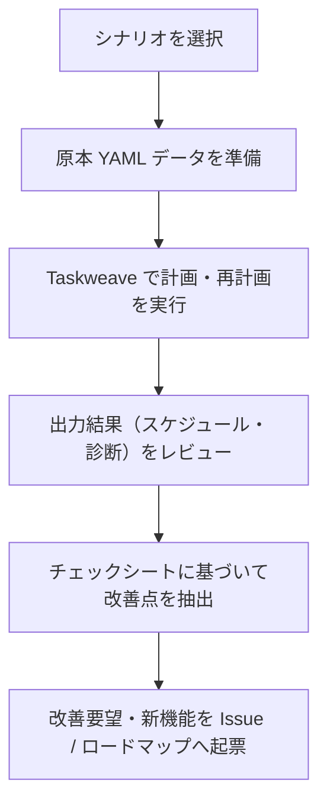

# Taskweave 実務動作確認シナリオ集

Taskweave の操作手順起点（「コマンドの使い方」「YAML の書き方」）ではなく、**実際のソフトウェア開発業務・現場で日常的に直面するリアルな状況・トラブル**を題材にした動作確認シナリオ集です。

各シナリオを通じて実際に Taskweave を動かし、ツールの実用性、制約表現力、アルゴリズムの妥当性、および現場視点での改善点（課題）を洗い出すことを目的とします。

---

## 1. シナリオ一覧とフォーカス領域

| シナリオ                                                                      | 業務シチュエーション        | 主な現場の出来事                                       | 検証する Taskweave 機能                                         | 改善点発掘の着眼点                                                     |
| :---------------------------------------------------------------------------- | :-------------------------- | :----------------------------------------------------- | :-------------------------------------------------------------- | :--------------------------------------------------------------------- |
| **[01. 見積超過・手戻りと納期危機](./01-overrun-and-replan.md)**              | 2週間の新機能スプリント開発 | 外部OAuth連携で手戻り工数超過（16h→28h見込み）         | 実績記録 (`actuals.yaml`)、起算日再計画、納期遅延診断           | 着手済みタスクのピン留め柔軟性（引き継ぎ）、遅延タスクのトリアージ支援 |
| **[02. キースタッフ突発病欠と属人化の壁](./02-sudden-absence-and-skills.md)** | 本番切替直前のインフラ移行  | 唯一のインフラ担当者がインフルエンザで3日間突発病欠    | 個別不在 (`absences`)、スキル制約 (`required_skills`)、代替割当 | 属人化タスクの不在ハンドリング、SPOF事前診断、不在登録のUX             |
| **[03. 緊急割り込みタスクとスコープ調整](./03-emergency-interruption.md)**    | 定常改善スプリント進行中    | 本番決済エラー（P0重大障害）による緊急パッチ割り込み   | 割り込みタスク追加、再計画、玉突き遅延                          | 優先度（Priority）の明示的表現、先送り（スコープ除外）ワークフロー     |
| **[04. 飛び石連休と混成チーム](./04-holiday-and-part-time.md)**               | GW（大型連休）を跨ぐ開発    | 時短勤務社員（5h/日）と週2日稼働の副業エキスパート混在 | 飛び石非稼働日スキップ、稼働上限、中抜け抑制                    | メンバー個別稼働曜日の設定負荷、連休前後のタスク分割・継続性           |

---

## 2. シナリオの構成要素

各シナリオドキュメントは、以下の標準構成で統一されています：

1. **業務背景とチーム体制**: プロジェクトの期間、締め切り（納期）、メンバーのスキルと日別稼働キャパシティ。
2. **時系列ストーリー（現場のリアルな出来事）**: Day 1（初期計画）から始まり、現場で発生したトラブル、PMやリーダーが迫られる判断を物語形式で記述。
3. **Taskweave 原本データ定義**: 実際に検証に使用できる完全な原本 YAML（`members.yaml`, `tasks.yaml`, `calendar.yaml`, `actuals.yaml`）。
4. **Taskweave での動作・出力**: 初期計算結果、As-of 起算日再計画、ボトルネック診断レポートの期待値。
5. **改善点発掘チェックシート（評価観点）**: 現場のエンジニア・PM視点で「ここが使いにくい」「この機能が足りない」「この挙動は不自然」と感じるチェック項目。

---

## 3. 動作確認と改善フィードバックの流れ

1. **再現実行**: シナリオに記載されている YAML データをディレクトリに配置し、`taskweave validate` および Python エンジンでスケジュールを計算します。
2. **実務妥当性の評価**: 計算結果が「現場の感覚として納得できるスケジュールになっているか」を確認します。
3. **課題の抽出とフィードバック**: 「改善点発掘チェックシート」の項目を検証し、発見された不足機能や使い勝手の課題を GitHub Issue や Milestone 4/5 のロードマップへ還元します。
